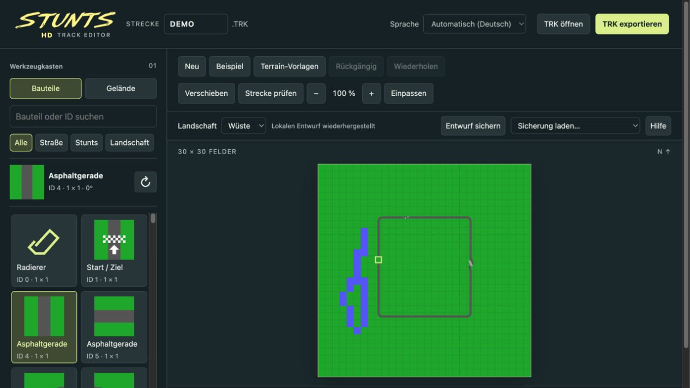

# Stunts HD Track Editor

A standalone track editor for **Stunts / 4D Sports Driving**, with a sharp, zoomable vector map and familiar top-down track pieces. The editor runs locally in your browser; imported tracks and drafts are never uploaded.

[Deutsche Anleitung](README.de.md)



## Use the editor

Download the `stunts-hd-track-editor-v1.4.1-web.zip` asset from this repository's **Releases** page, extract it, and open `index.html`. No installation, account, or external dependencies are needed. Alternatively, open `dist/index.html` from this repository.

Draft recovery may be limited when using `file://`, depending on your browser. Track import and export remain available. To use a local web server, see the development instructions below.

## Features

- German, English, Spanish, Italian, and French. The initial language follows your browser preferences, with English as the fallback. A manual selection is remembered.
- A 30 × 30 track grid, with all 183 supported track-piece identifiers and independently drawn vector symbols inspired by the original editor.
- Import and export 1,802-byte `.TRK` files. Unknown identifiers, the horizon, and the final metadata byte survive an unchanged round trip.
- Multi-cell pieces, rotation, categories, search, and whole-piece replacement or erasure.
- All 19 terrain types, with five original terrain presets and previews. Apply terrain to an existing track, or start a new track on that terrain.
- Undo and redo for up to 100 changes, automatic local draft recovery, and ten manual saves per browser origin.
- Zoom, fit-to-view, panning, desktop and mobile layouts, and keyboard controls.
- Optional WebMCP browser tools for reading tracks, finding and placing pieces, applying terrain presets, and undoing changes.

The editor does not change an installed copy of the game. Export a `.TRK` file and copy it into your game separately.

## Controls

| Action | Control |
| --- | --- |
| Draw | Click or drag |
| Erase | Right-click |
| Rotate the selected piece | `R` |
| Pick a piece from the map | `Alt` + click |
| Move the selected grid cell | Arrow keys while the map is focused |
| Place / erase at the selected cell | Space / Delete |
| Undo / redo | `Ctrl` or `⌘` + `Z` / add Shift |

Local saves belong to the current browser and webpage address. Exported tracks can be kept independently.

## Develop

Use Node.js 22 or later. There are no packages to install.

```sh
npm test
npm run build
npm start
```

Open `http://127.0.0.1:48321/`. The `src/` directory contains the source. The build bundles the editor into `dist/index.html`; `dist/` can be served by any static web host.

```sh
npm run release
```

This creates offline and source ZIP packages and `SHA256SUMS.txt` in `release/`. Packaging uses the `zip` command, available on macOS and most Linux distributions.

## Limitations

The piece and terrain symbols are independently drawn approximations; no extracted original bitmap artwork is included. Structure checking detects missing start/finish lines, invalid boundaries, overlaps, continuation markers, and unknown identifiers. It does **not** validate the complete driving route or physical drivability. Terrain and track combinations are not automatically repaired. Test the finished track in the game.

## License and credits

**GPL-3.0-only.** See [LICENSE](LICENSE) and [third-party notices](THIRD_PARTY_NOTICES.md).

Track identifiers, rotations, footprints, and terrain layouts follow the PlayStunts format tables and editor data. The five terrain presets contain terrain identifiers only. This project includes no original game executable, extracted game artwork, cars, sounds, or original tracks. The example track was created for this editor.
